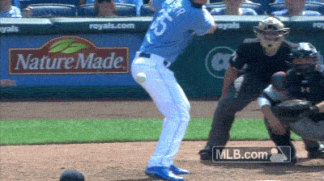

# Walkoff-js

This is an ***opinionated*** set of choices for starting a new software product. 
I believe starting a new project should feel like this:

and not like this:

# Assumptions

You're trying to build a "modern" app.  While there are literally thousands of ways to do this, 
this setup assumes the following:
